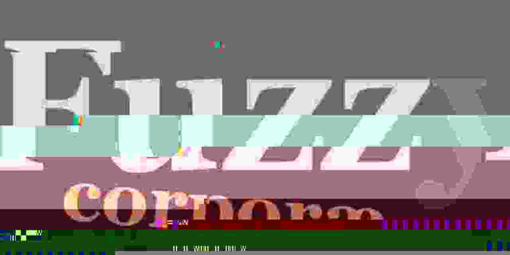

# serenity-fuzz-corpora

Useful files, untainted by GPL that *could* be merged into Serenity,
but I don't want to feel guilty about committing so many "useless"
files into permanent history.

All files are generated by me, either using a painting program,
or a hexeditor, or a fuzzer. Does *not* base on the GPL'd bmpsuite.

Same license, etc.

